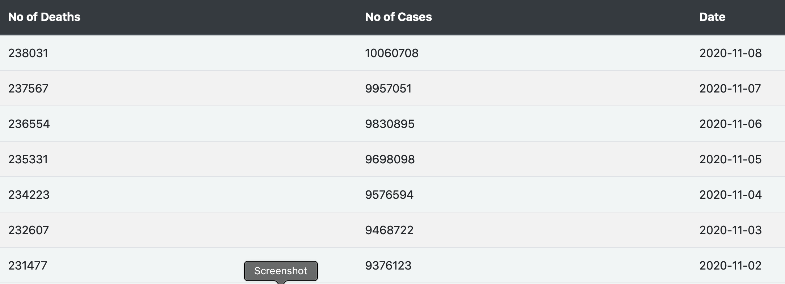
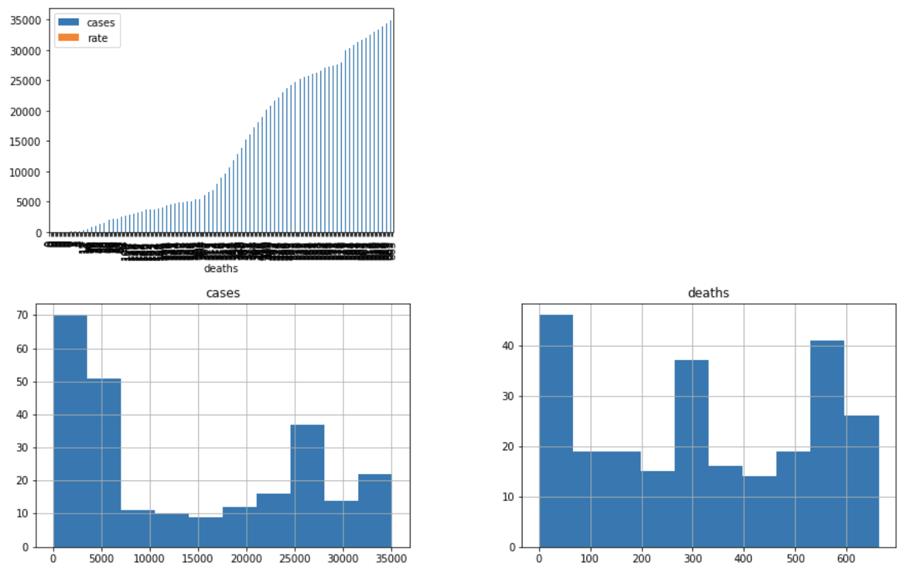
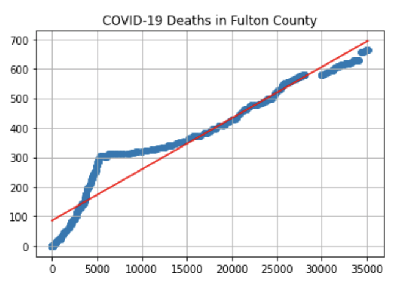
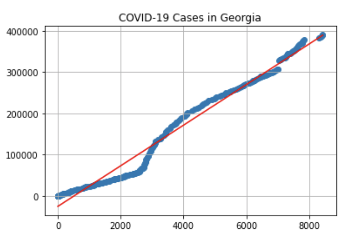

# SC20_covid_projection
This project is for the SC20 Hackathon and this is a project that uses linear regression to show a trend and try to predict the impact of COVID-19 in Fulton County, Georgia and the whole state of Georgia.

## Access Our App:
1. Make sure all the dependencies are met. Run pip install -r requirements.txt in your projects terminal
1. Run main.py
1. Expose localhost to the internet
1. Visit http://localhost:8000/
1. Familiarize yourself with our site and navigation bar 
    - Homepage:
         - The homepage provides our team name and pictures of some tools we used to create this project
    - About us:
         - The about us page provides info on the team that worked on this project.
    - COVID-19:
         - The COVID-19 page provides the last seven days worth of COVID cases and deaths in the United States of America
         - It also provides details on COVID-19 common symptoms, information on who's most at risk and locations for COVID testing sites in Fulton County, Georgia
    
    - Jupyter Notebook:
         - This provides a link to a Jupyter notebook that can be shared with you as long as you sign it with a Gmail account.
         - You have the ability to run the cells to get COVID-19 data visualized for Fulton County and the state of Georgia
         
         - We provide a linear regression model to try and determine the impact of COVID-19 in Fulton County and Georgia
         
         
         
